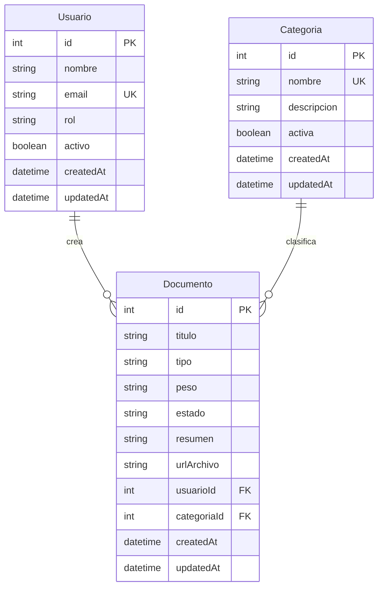

# 📂 API REST - Módulo de Gestión Documental (MiUNE 2.0)

Backend con Node.js + Express + Prisma ORM para gestión documental con persistencia real en PostgreSQL.

## 🛠️ Stack

- Node.js + Express
- Prisma ORM
- PostgreSQL
- Joi (validación)

## 🚀 Instalación

1. Clonar el repositorio
2. Instalar dependencias:

```bash
npm install
```

3. Copiar variables de entorno:

```bash
cp .env.example .env
```

4. Configurar `DATABASE_URL` en `.env`
5. Generar Prisma Client:

```bash
npm run prisma:generate
```

6. Ejecutar migraciones:

```bash
npm run prisma:migrate
```

7. Poblar datos de prueba:

```bash
npm run prisma:seed
```

8. Iniciar servidor:

```bash
npm run dev
```

Servidor local: `http://localhost:3000`

## 🌐 Endpoints

### Documentos (`/api/documentos`)

- `GET /` lista documentos (soporta `?page=1&pageSize=10`)
- `GET /:id` obtiene documento por ID
- `POST /` crea documento
- `PUT /:id` actualiza documento
- `DELETE /:id` elimina documento

Ejemplo body `POST /api/documentos`:

```json
{
  "titulo": "Reglamento Académico 2026",
  "tipo": "application/pdf",
  "peso": "1.5MB",
  "estado": "borrador",
  "resumen": "Versión preliminar para revisión",
  "urlArchivo": "https://docs.miune.edu/reglamento-2026.pdf",
  "usuarioId": 1,
  "categoriaId": 2
}
```

### Categorías (`/api/categorias`)

- `GET /` lista categorías
- `GET /:id` obtiene categoría por ID
- `POST /` crea categoría
- `PUT /:id` actualiza categoría
- `DELETE /:id` elimina categoría (si no tiene documentos asociados)

Ejemplo body `POST /api/categorias`:

```json
{
  "nombre": "Normativas",
  "descripcion": "Reglamentos y políticas institucionales",
  "activa": true
}
```

## 🧠 Esquema de Base de Datos



## 📁 Estructura Relevante

```text
prisma/
├── schema.prisma
├── migrations/
└── seed.js

src/
├── controllers/
├── lib/
├── middleware/
├── models/
└── routes/
```

## ✅ Estado del entregable Semana 3

- 3 tablas relacionadas: `Usuario`, `Categoria`, `Documento`
- Migración inicial en `prisma/migrations/`
- CRUD completo de `Documento` y `Categoria`
- Seed con datos de prueba realistas y relaciones
- `.env.example` con `DATABASE_URL`

## 🧪 Colección Postman

Se incluye una colección para validar el flujo CRUD end-to-end:

- `postman/miune-docs-api-semana3.postman_collection.json`
